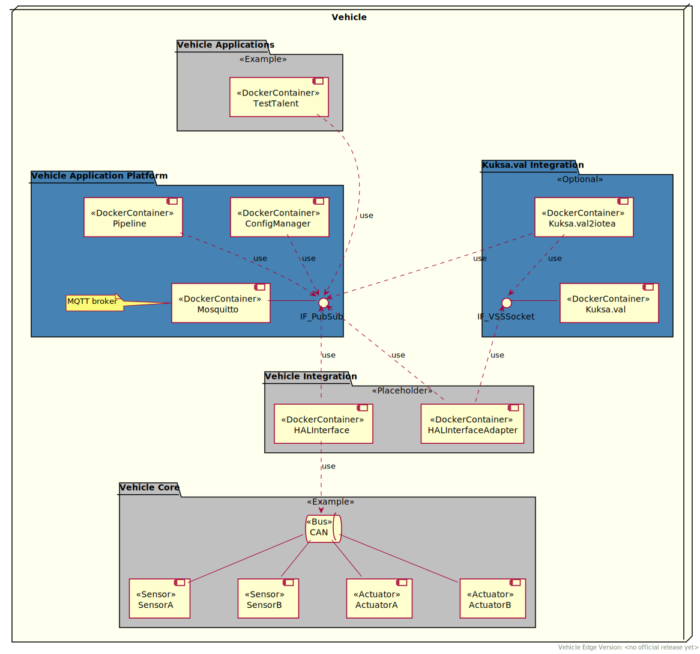

<!---
  Copyright (c) 2021 Robert Bosch GmbH

  This Source Code Form is subject to the terms of the Mozilla Public
  License, v. 2.0. If a copy of the MPL was not distributed with this
  file, You can obtain one at https://mozilla.org/MPL/2.0/.

  SPDX-License-Identifier: MPL-2.0
-->

# Deployment of Vehicle Edge

## Overview

The Vehicle Edge consists of several docker containers to setup the mandatory platform and platform services and an optional vehicle integration for development and testing purpose.

## Deployment Diagram

This diagram shows the 'default' deployment of Vehicle Edge when the docker-compose file _docker-compose.edge.yml_ is used. Beside the mandatory packages (blue), this deployment uses examples and placeholders (gray). Therefore, it should be seen as an example how it could look like. Packages are used to logically group the docker-containers regarding their scope and feature set.

## Overview of Packages

 * __Vehicle Applications__ (Example) 
   This package contains _Vehicle Applications_ like the example _TestTalent_ which logs a [VSS](https://github.com/GENIVI/vehicle_signal_specification) signal to console. _Vehicle Applications_ are using the _Vehicle Application Platform_ for communication and _Vehicle Application Platform Services_ to access the [VSS](https://github.com/GENIVI/vehicle_signal_specification) tree which is provided by _VSS2IoTEA_.

   [IoT Event Analytics](https://github.com/GENIVI/iot-event-analytics) provides SDKs to develop _Vehicle Applications_.

 * __Vehicle Application Platform Services__ 
   This package contains _Vehicle Application Platform Services_ like the _VSS2IoTEA_ and [_KUKSA.val_](https://github.com/eclipse/kuksa.val).

   _VSS2IoTEA_ provides the VSS data tree to the _Vehicle Application Platform_.
   [_KUKSA.val_](https://github.com/eclipse/kuksa.val) is optional and can be used to collect mapped vehicle signals and to store it in a vehicle data tree instance. If it is not used, _HALInterfaceAdapter_ directly sends mapped [VSS](https://github.com/GENIVI/vehicle_signal_specification) events to _VSS2IoTEA_.

 * __Vehicle Application Platform__ 
   This package contains the mandatory _Vehicle Application Platform_ components like the _ConfigManager_, _Pipeline_ and _Mosquitto_ (MQTT Broker) which provides event (pub-sub) based communication incl. additional meta data like statistics using [IoT Event Analytics](https://github.com/GENIVI/iot-event-analytics).

 * __Vehicle Integration__ (Placeholder) 
   This package contains the _HALInterface_ and _HALInterfaceAdapter_ which can be used to connect to a CAN Bus (via SocketCAN) or to mock CAN signals. These signals are mapped to [VSS](https://github.com/GENIVI/vehicle_signal_specification) and sent to [_KUKSA.val_](https://github.com/eclipse/kuksa.val) or directly to _VSS2IoTEA_ (bypass).

 * __Vehicle Core__ (Example) 
   This is an example for existing vehicle elements like sensors and actuators connected via a CAN Bus.
